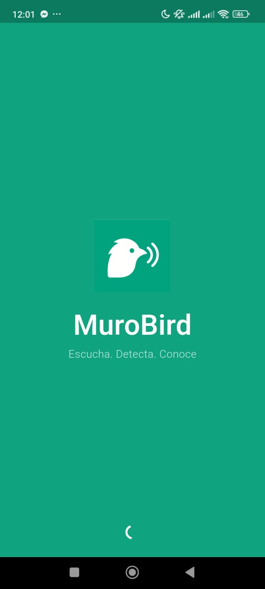
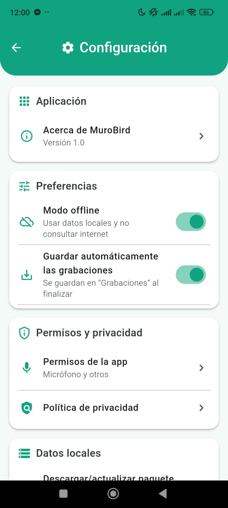
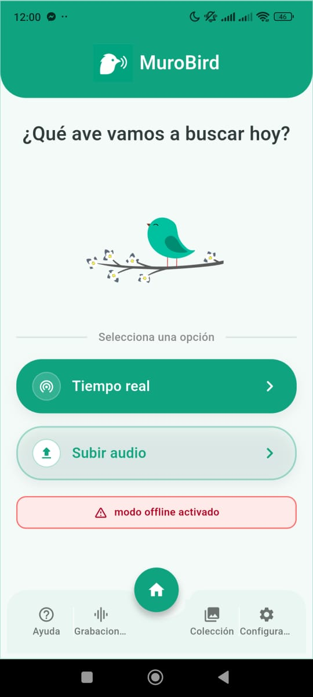
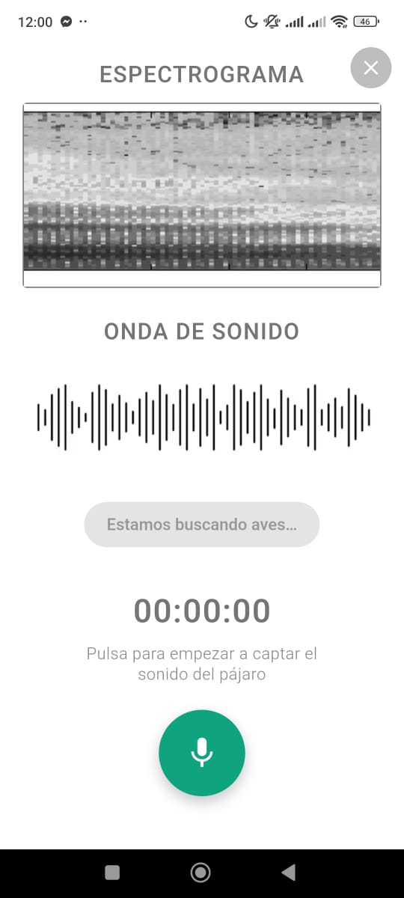
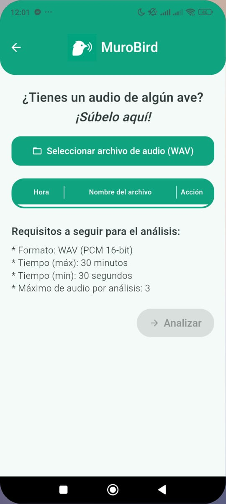

# 🐦 MuroBird

¡Bienvenido al repositorio de MuroBird! Esta es una aplicación que escucha, detecta y conoce las aves.

## 🚀 Funcionamiento

-Captar las señales de audio.  
-Muestrear las señales con tecnicas de filtrado y segmentacion.  
-Implementar algoritmos de aprendizaje automatico (Huellas acusticas y Redes neuronales convolucionales). 

##  📱 Instalar APK

https://www.mediafire.com/file/woskyhsfhbai7ew/MuroBirdAPK.apk/file

### 1. Pantalla de Inicio

La primera vista que encontrarás al abrir la aplicación.

### 2. Configuración y Lobby

Aquí puedes ver la pantalla de configuración y el lobby principal de la aplicación.

 

### 3. Opciones de Interfaz

Dos ejemplos de las diferentes opciones o funcionalidades dentro de la aplicación.

 

---
##  Paquete del sonido de las aves
https://www.mediafire.com/file/ia6yshuv5kpq01k/audios_aves.rar/file

